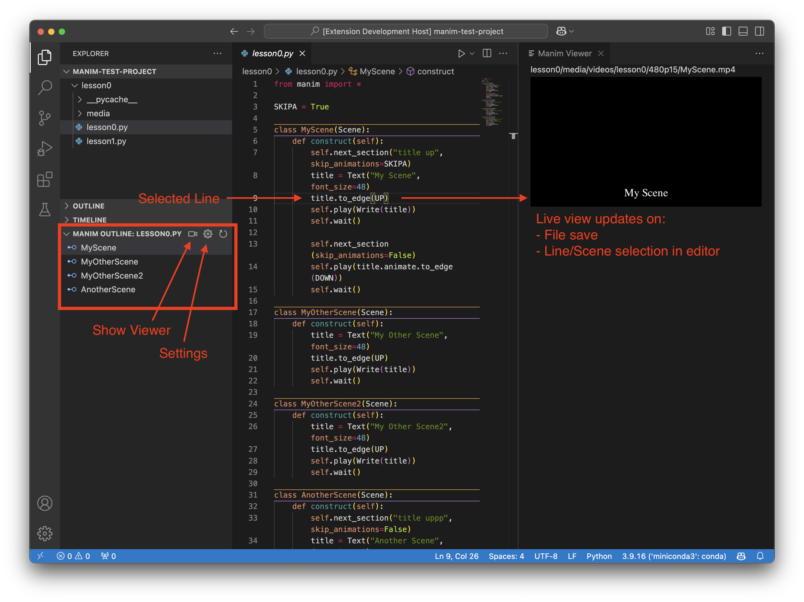

# manim-viewer

Live view for cursor-selected Manim scenes in Visual Studio Code.

## Features/Quickstart

Always preview the scene you are working on in the code editor without having to click through any menus to select it!

1. Ensure your active Python interpreter has manim installed on its path.
2. Open a python file to activate the Manim Outline view under the file explorer view.
3. Click the video icon in the Manim Outline view to open the viewer tab alongside the code editor.
4. Then just click on a scene in the code editor (or Manim Outline view) to view it live in the viewer tab.
5. After editing a scene's code, save the code file to update the viewer with a freshly rendered video.

- Only render when needed. Manim-viewer is smart enough not to re-render scene's whose code has not changed. To do this the code for each rendered scene is cached in a `manimViewer.json` file alongside the video file. Upon recieving a render request, manim-viewer only renders the scene if a video at the designated path does not yet exist or if the scene's code has changed (non-indent whitespace is ignored) with respect to the cached code.
- The render quality can be set in the extension settings (gear icon in Manim Outline view).
- Finally, manim-viewer automatically cleans up any outdated partial video files for you.

## Requirements

- Python extension for Visual Studio Code
- Make sure that Manim is installed on your PATH.

## Extension Settings

This extension contributes the following settings:

* `manimViewer.renderQuality`: Choose Manim's render quality.

## Support

This is all done in my free time. If you find it useful, why not buy me a cup of coffee? Cheers!

## Release Notes

### 1.0.0

Initial release of manim-viewer.

---
