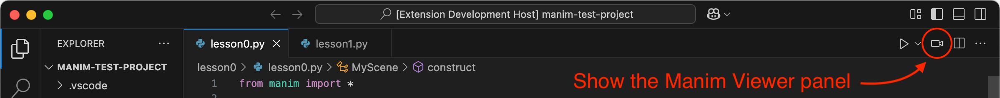
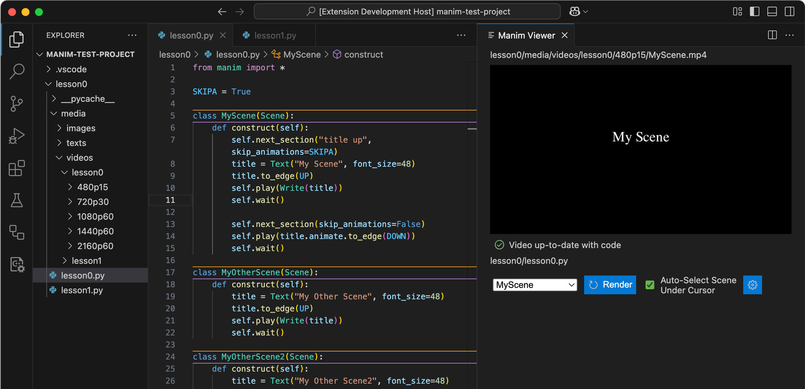

# Manim Viewer
Live view for Manim scenes in Visual Studio Code.

**!!! Major changes and improvements over v1.0.3 !!!** (see CHANGELOG)

## Features
- Simple and intuitive scene selection and rendering via a custom webview panel.
- Optionally auto-load video for scene under cursor.
- Only render when code has changed. This involves caching scene code in a `manimViewer.json` file alongside the video file.
- Live report of video status with respect to current code (e.g., up-to-date or not).
- Automatically cleans up any outdated partial video files for you.

## Quickstart
1. Ensure your active Python interpreter has manim installed on its path.
2. Open a python file to activate the extension.
3. Click the video icon in the upper right editor toolbar to open the Manim Viewer webview panel.
4. Scene selection and rendering using the Manim Viewer panel should be self-evident.
5. By default, saving the code file will re-render the selected scene video (but only if the code has changed).
6. Click the settings button in the Manim Viewer panel to customize its behavior (currently just render quality and whether to re-render on save).

## Requirements

- Python extension for Visual Studio Code
- Make sure that Manim is installed on your PATH.

## Extension Settings

This extension contributes the following settings:

- `manimViewer.renderQuality`: Choose Manim's render quality.
- `manimViewer.renderOnSave`: Auto-render on file save.

## Support

This is all done in my free time. If you find it useful, why not buy me a cup of coffee? Cheers!

## Release Notes

### 1.0.0
Initial release of manim-viewer.

### 2.0.0
Major changes and improvements over v1.0.3! See CHANGELOG for details.

## TODO
- Handle file deletion and file renaming events.
- Allow user specification of the output video filepath.

## Dev Notes
To generate a `.vsix` file run `vsce package`

---
